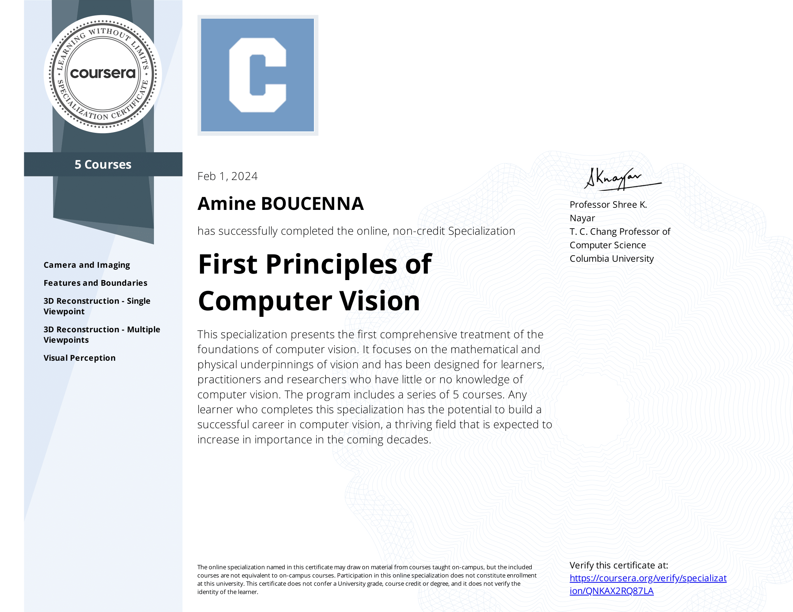

# First Principles of Computer Vision Specilization (Columbia University)
- Instructor: Shree Nayar
- Platform: Coursera
- A specialization of 5 course series
- The condidate have only 2 tries

### ❗My responses can be found within the course directories.

## Course I : Camera and Imaging
### [Course I certificate](https://www.coursera.org/account/accomplishments/verify/XC3DRL8HGVBT)

## Course II : Features and Boundaries
### [Course II certificate](https://www.coursera.org/account/accomplishments/verify/B9EZFJZ8V9XZ)

## Course III : 3D Reconstruction - Single Viewpoint
### [Course III certificate](https://www.coursera.org/account/accomplishments/verify/WX8XHE66SZ2L)

## Course VI : 3D Reconstruction - Multiple Viewpoints
### [Course VI certificate](https://www.coursera.org/account/accomplishments/verify/6U2HHRVEZJWW)

## Course V : Visual Perception
### [Course V certificate](https://www.coursera.org/account/accomplishments/verify/9X9D65ZE8FC7)
